# ZJU-blockchain-course-2023

⬆ 可以️修改成你自己的项目名。

> 第二次作业要求（以下内容提交时可以删除）：
> 
> 简易汽车借用系统，参与方包括：汽车拥有者，有借用汽车需求的用户
>
> 背景：ERC-4907 基于 ERC-721 做了简单的优化和补充，允许用户对NFT进行租借。
> - 创建一个合约，在合约中发行NFT集合，每个NFT代表一辆汽车。给部分用户测试领取部分汽车NFT，用于后面的测试。
> - 在网站中，默认每个用户的汽车都可以被借用。每个用户可以： 
>    1. 查看自己拥有的汽车列表。查看当前还没有被借用的汽车列表。
>    2. 查询一辆汽车的主人，以及该汽车当前的借用者（如果有）。
>    3. 选择并借用某辆还没有被借用的汽车一定时间。
>    4. 上述过程中借用不需要进行付费。
> 
> - （Bonus）使用自己发行的积分（ERC20）完成付费租赁汽车的流程
> - 请大家专注于功能实现，网站UI美观程度不纳入评分标准，但要让用户能够舒适操作。简便起见，可以在网上找图片代表不同汽车，不需要将图片在链上进行存储。

**以下内容为作业仓库的README.md中需要描述的内容。请根据自己的需要进行修改并提交。**

作业提交方式为：**提交视频文件**和**仓库的链接**到指定邮箱。

## 如何运行

补充如何完整运行你的应用。

1. 在本地启动ganache应用。

2. 在 `./contracts` 中安装需要的依赖，运行如下的命令：
    ```bash
    npm install
    ```
3. 在 `./contracts` 中编译合约，运行如下的命令：
    ```bash
    npx hardhat compile
    ```
4. 在 `./contracts` 中部署合约，运行如下的命令:
    ```bash
    npx hardhat run ./scripts/deploy.ts --network ganache
    ```
    输出的部署后地址如下:
    ```bash
    Geo deployed to 0x6bD00047BD6ad029b17299560ED645cEDb7922B4
    BorrowYourCar deployed to 0x50e1aF0A19F594Ad8003B42919843cBADb0a769d
    ```
5. 合约部署后，在`frontend`目录下创建`utils`目录，再在`utils`目录中创建`abis`目录和`contract-addresses.json`文件，然后在`./contracts/artifacts/contracts`中找到`BorrowYourCar.json`和`token.json`，将其复制到`./frontend/utils/abis/`中，最后在`contract-addresses.json`文件修改Geo和BorrowYourCar的地址
6. 在 `./frontend` 中安装需要的依赖，运行如下的命令：
    ```bash
    npm install
    ```
7. 在 `./frontend` 中启动前端程序，运行如下的命令：
    ```bash
    npm run start
    ```

## 功能实现分析

1. 添加汽车功能。
    我们在BorrowYourCar.sol文件中添加了createCar()函数，该函数能在当前用户的汽车中创建一辆新的汽车，生成的汽车ID通过区块序数和区块的时间戳共同决定，尽可能保证汽车ID唯一。在我们初始化汽车的拥有者为当前用户，没有借用者后，我们会在该用户的汽车和可借用汽车中添加该汽车的信息。

2. 查询汽车功能
    我们在BorrowYourCar.sol文件中添加了queryAvailableCars()，queryBorrowedCars()，queryOwnerCars()，queryOwner(uint256 index)，queryBorrower(uint256 index)等函数，这些函数可以对指定ID的汽车的拥有者和借用者进行查询，还可以按照当前用户的拥有汽车，当前全部可以借用的汽车和当前全部已经借用的汽车。

3. 更新汽车功能
    我们在BorrowYourCar.sol文件中添加了updateCar()函数，该函数可以对当前全部已经借用的汽车进行检查，一旦存在汽车的归还时间超过当前的区块时间戳，就会将该汽车的信息从已经借用的汽车列表里移除并添加到可借用汽车列表中，并将之前借用者消除，自动完成借用状态的更新。

4. 删除汽车功能
    我们在BorrowYourCar.sol文件中添加了deleteAvailableCar(uint256 index)和deleteCar(uint256 index)函数，前者可以对被借用汽车进行删除，删除内容包括在用户汽车列表，可借用汽车列表的信息。后者可以对汽车进行强制删除，删除内容包括在用户汽车列表，可借用汽车列表的信息及不可借用汽车列表信息。

5. 借用汽车功能
    我们在BorrowYourCar.sol文件中添加了borrowCar(uint256 index, uint256 duration)函数，该函数可以对汽车进行借用，在借用指定汽车时，会判断汽车ID是否存在，借用人是否为汽车拥有者。只有在汽车ID存在，借用人不为该汽车拥有者的情况下才会对该汽车进行借用。在借用时会根据借用时长计算费用，只有在借车费用大于当前用户余额时,才能成功借车。借车完成后会修改汽车的借用人和归还时间，将汽车从可借用汽车列表中移动到借用汽车列表中。

6. 归还汽车功能
    我们在BorrowYourCar.sol文件中添加了returnCar(uint256 index)函数，该函数可以对汽车进行归还，在归还指定汽车时，会判断汽车ID是否存在，归还人是否为汽车拥有者。只有在汽车ID存在，归还人不为该汽车拥有者且为该汽车借用者的情况下才会对该汽车进行归还。归还完成后会修改汽车的借用人和归还时间，将汽车从借用汽车列表中移动到可借用汽车列表中。

## 项目运行截图
### 进入项目首页
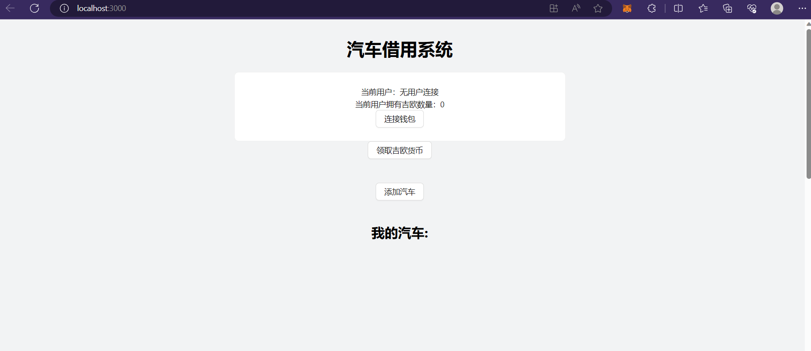
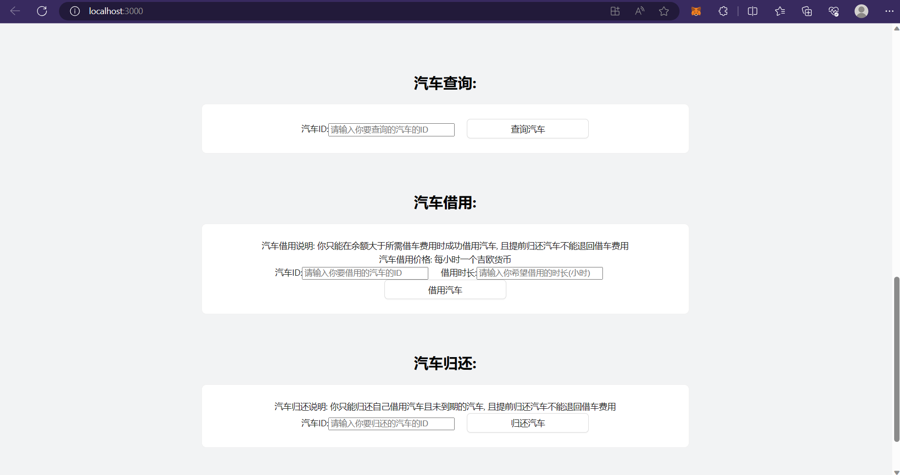
### 选择MetaMask用户登录
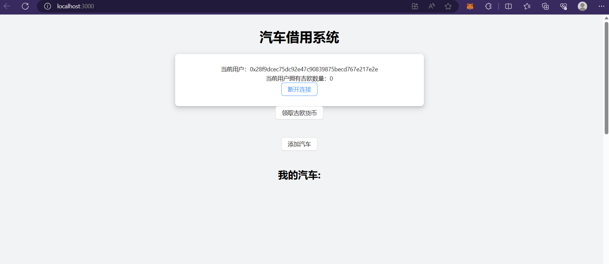
### 为当前用户添加汽车
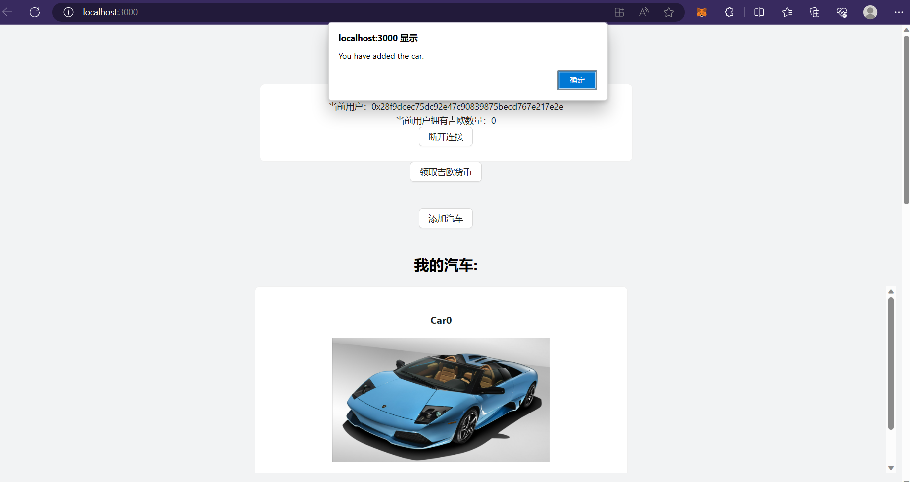
### 查看当前用户汽车ID和可借用汽车
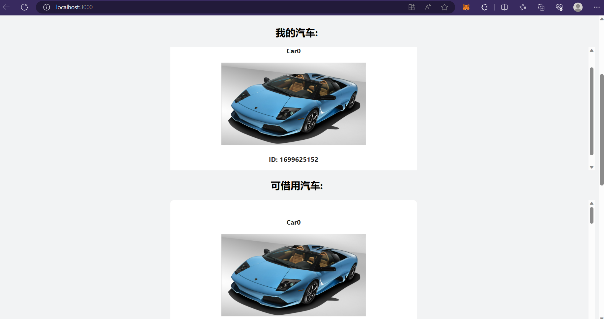
### 使用汽车ID查询汽车信息
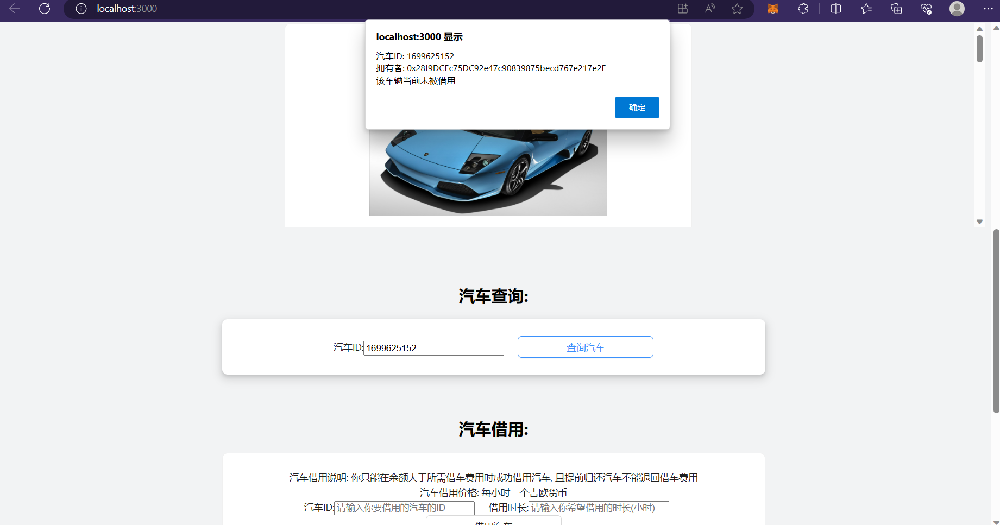
### 尝试借用当前用户拥有的汽车
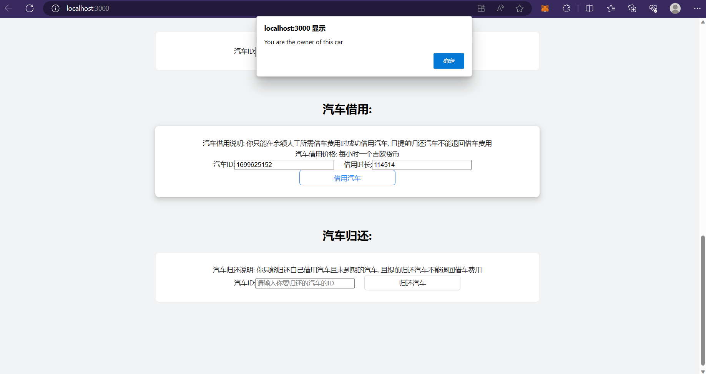
### 尝试归还当前用户拥有的汽车
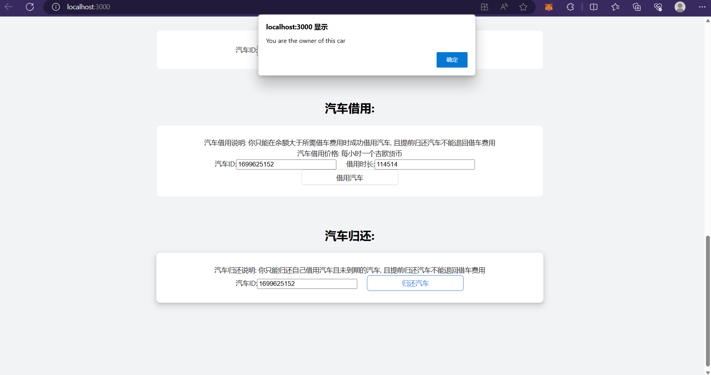
### 为当前用户领取货币

### 选择新用户登录并为之添加汽车
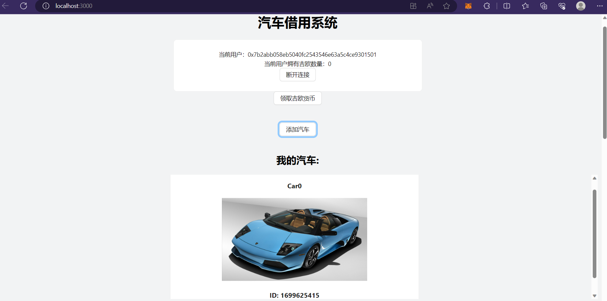
### 回到之前登录的用户并向新用户借用汽车
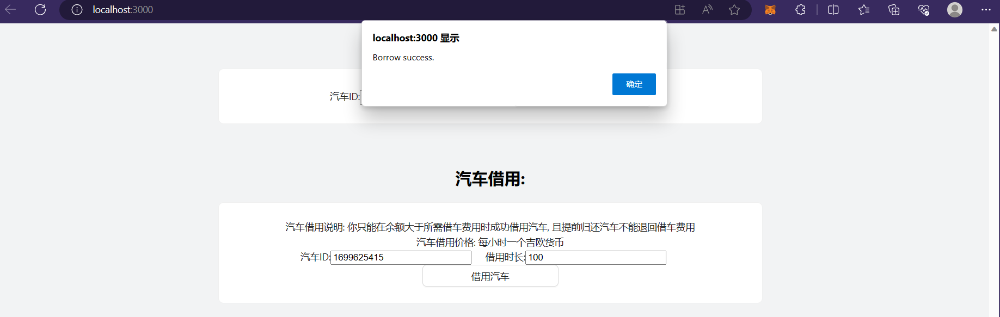
### 根据汽车ID查看新用户汽车信息
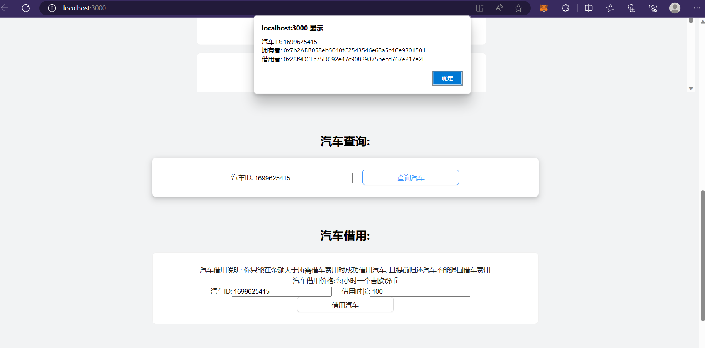
### 查看借车用户剩余代币数量
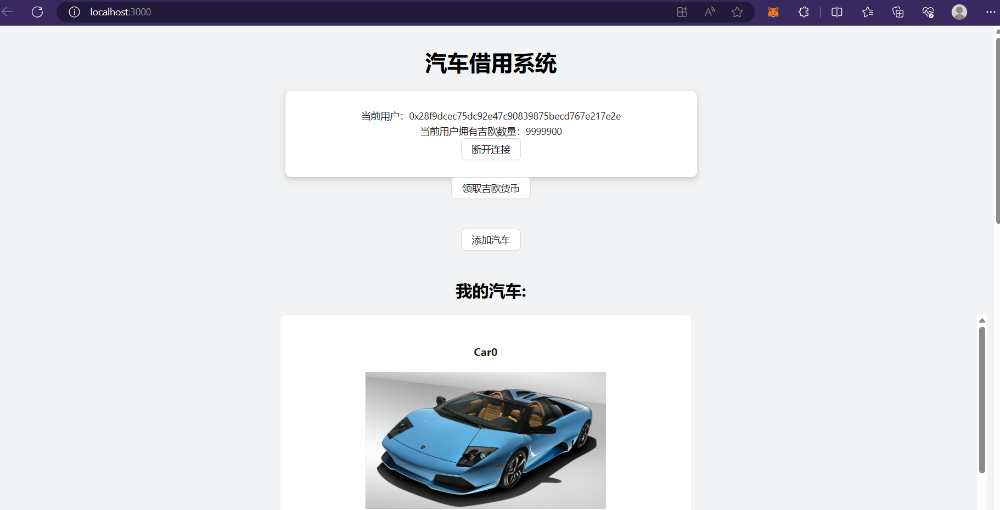
### 查看新用户剩余代币数量
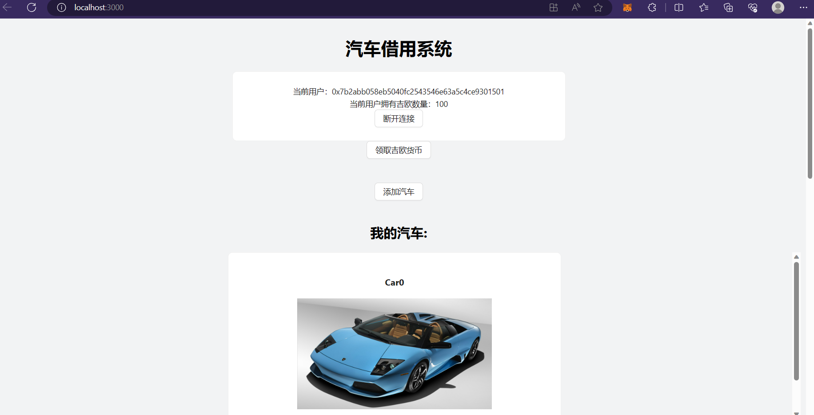
### 登录借车用户选择归还刚才借用的汽车
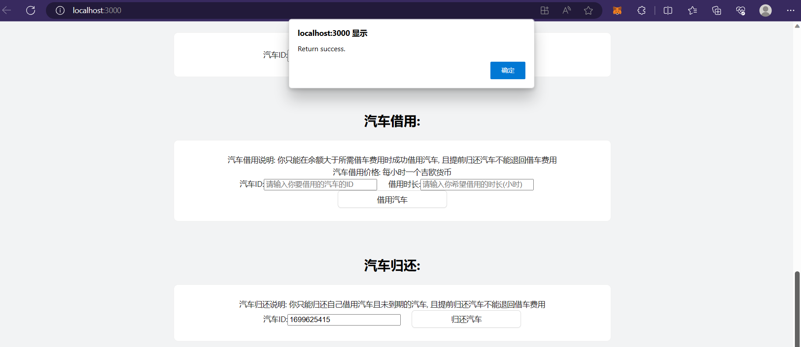
### 查看归还后的汽车信息
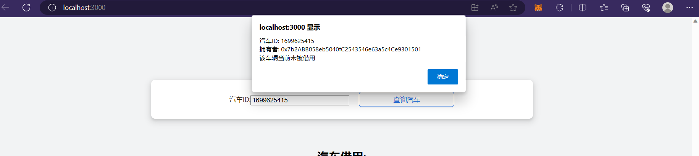
## 参考内容

- 课程的参考Demo见：[DEMOs](https://github.com/LBruyne/blockchain-course-demos)。

- ERC-4907 [参考实现](https://eips.ethereum.org/EIPS/eip-4907)
